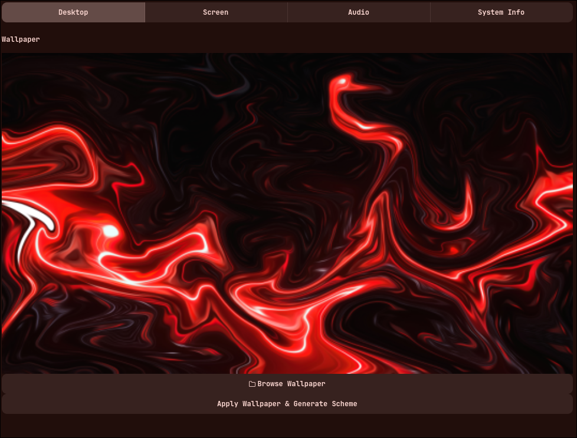
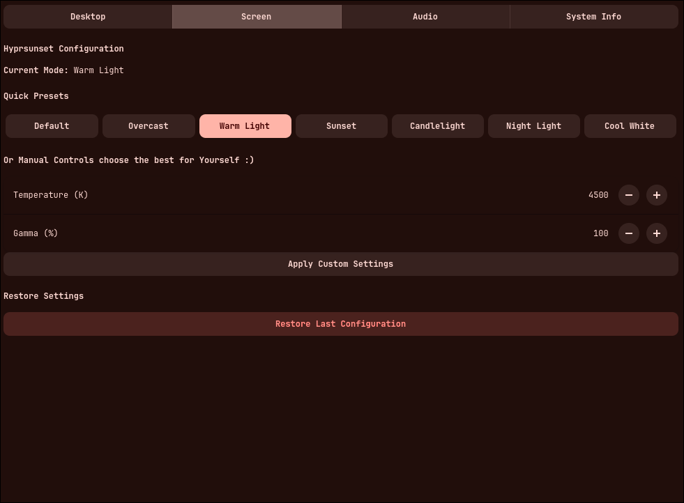
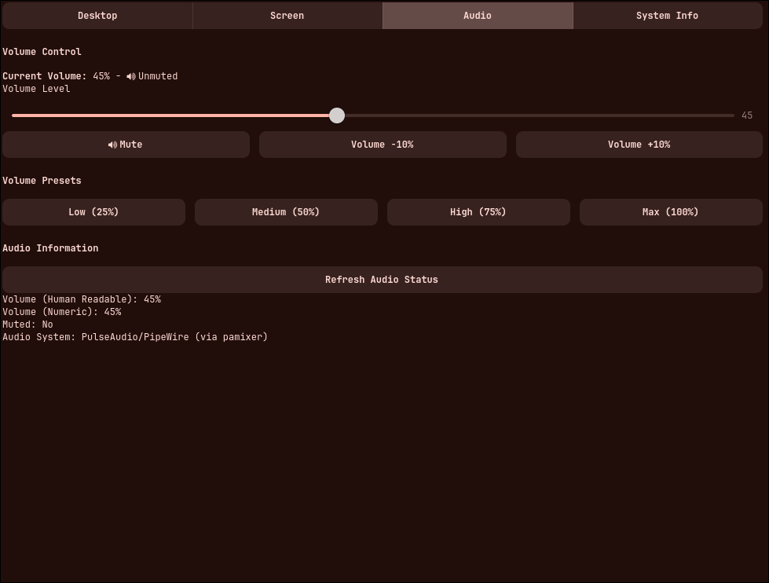

# HYPRSETTINGS
a simple Control Panel designed for hyprland as well this project are for my own dotfiles but is opened for everyone

# OVERVIEW
This program helpfull to manage screen light wallpaper audio and for fun sysinfo

# INSTALL
>[!NOTE]
 GIT version currently the most stable due to young age of project so if you want most new > bugfixes for now in your best interest Clone the  REPO 

and install with *make*

1)
```
$ make prepare
```
2)
```
# sudo make install
```

# Arch based
```
$ makepkg -si
```

# LAYOUTS OVERVIEW
<table>
  <tr>
    <td align="center">
      <br/>
      <b>DESKTOP</b>
    </td>
    <td align="center">
      <br/>
      <b>SCREEN</b>
    </td>
  </tr>
  <tr>
    <td align="center">
      <br/>
      <b>AUDIO</b>
    </td>
    <td align="center">
      <br/>
      <b>SYSINFO</b>
    </td>
  </tr>
</table>

## CONTRIBUTE
Fork the repo and then do your changes and then create PULL Request. 

**Rules For Pull Request:** 
1) describe what you added or changed.
2) Provide a Screenshots or video record to demonstrate changes.
3) Test it for yourself before doing Pull Request.

Or Simply Do Issue with bug report
Any Help and support Would be pleased.

# Credits For:
(iwnuplylo)[https://github.com/IwnuplyNotTyan] -> Arch Linux Package 