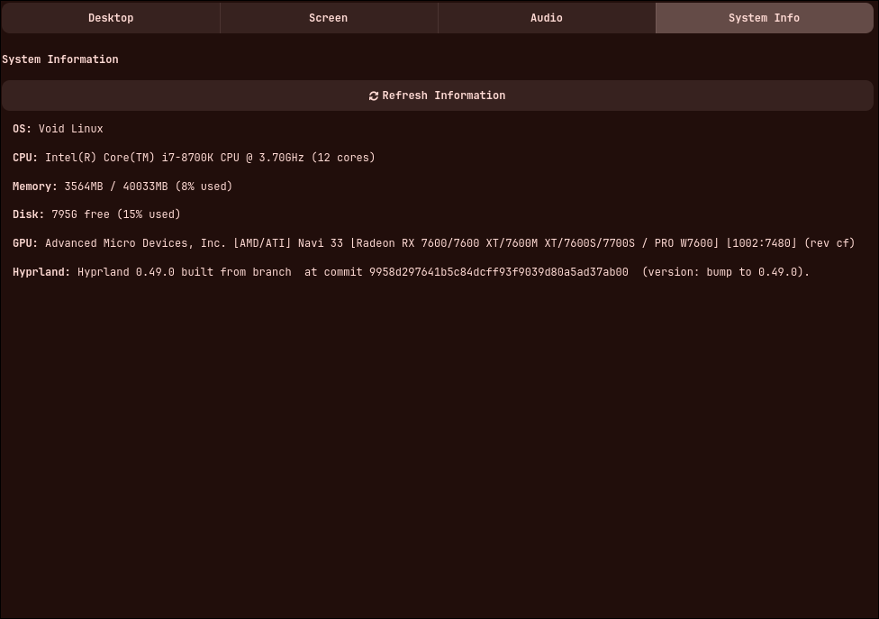

# HYPRSETTINGS
a simple Control Panel designed for hyprland as well this project are for my own dotfiles but is opened for everyone

# OVERVIEW
This program helpfull to manage screen light wallpaper audio and for fun sysinfo

# INSTALL
1)
```
$ make prepare
```
2)
```
# sudo make install
```

# LAYOUTS OVERVIEW
<table>
  <tr>
    <td align="center">
      <br/>
      <b>Image 1</b>
    </td>
    <td align="center">
      <br/>
      <b>Image 2</b>
    </td>
  </tr>
  <tr>
    <td align="center">
      <br/>
      <b>Image 3</b>
    </td>
    <td align="center">
      <br/>
      <b>Image 4</b>
    </td>
  </tr>
</table>
